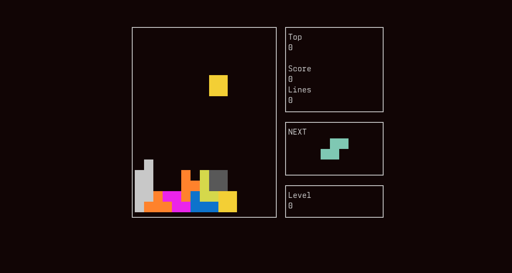

# hetris

A simple ncurses Tetris clone built in `halppp`



### Controls
- Up -> Rotate
- Space -> Drop 
- Left -> Move Left
- Right -> Move Right
- Down -> Move Down
- Enter -> Pause
- q -> Quit

### Installing

#### if you don't have the halppp compiler
```bash
git clone https://github.com/peg0ne/halppp.git`
# compile the compiler (It compiles itself three times)
cd halppp/compiler && ./rebuild.sh
cp main.ha $HOME/.local/bin/halppp
# compile the "build tool"
cd ../hamble && halppp main.ha -r
cp main.ha $HOME/.local/bin/hamble++
```
#### when you have the halppp compiler
```bash
git clone https://github.com/peg0ne/hetris.git
cd hetris
hamble++ build -r
hamble++ do make
# now you can run it
hetris
```
